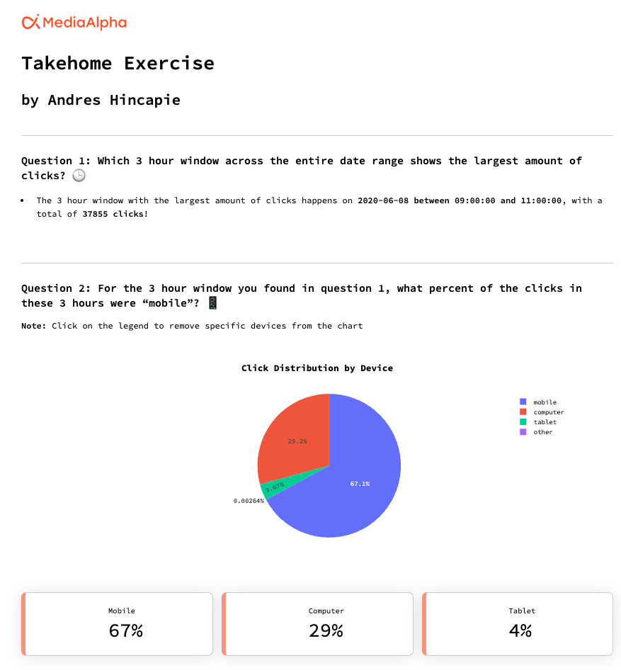
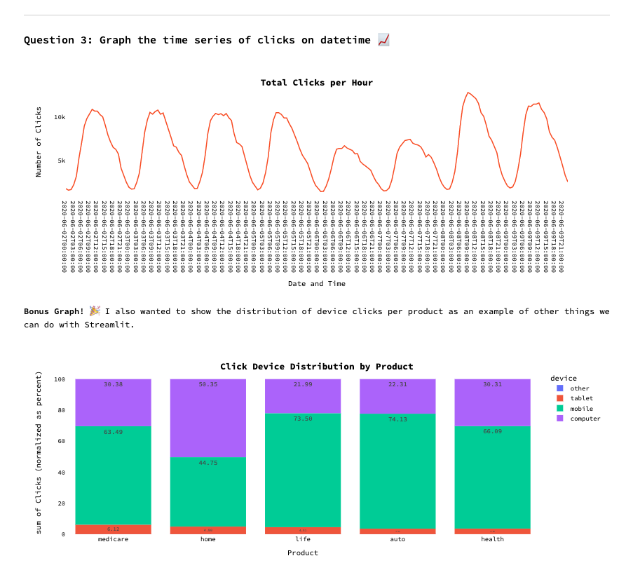
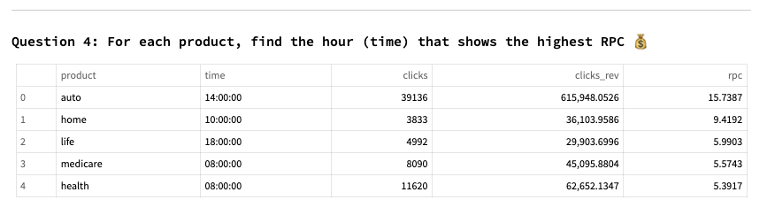

# Interactive Dashboard with Python - Streamlit

MediaAlpha Takehome Dashboard

## Run the app

```Powershell
# vanilla terminal
streamlit run app.py

# quit
ctrl-c
```

## Dashboard
[](https://andreshincapie-mediaalpha-streamlit-dash-app-7sds0a.streamlit.app/)

## Screenshots






